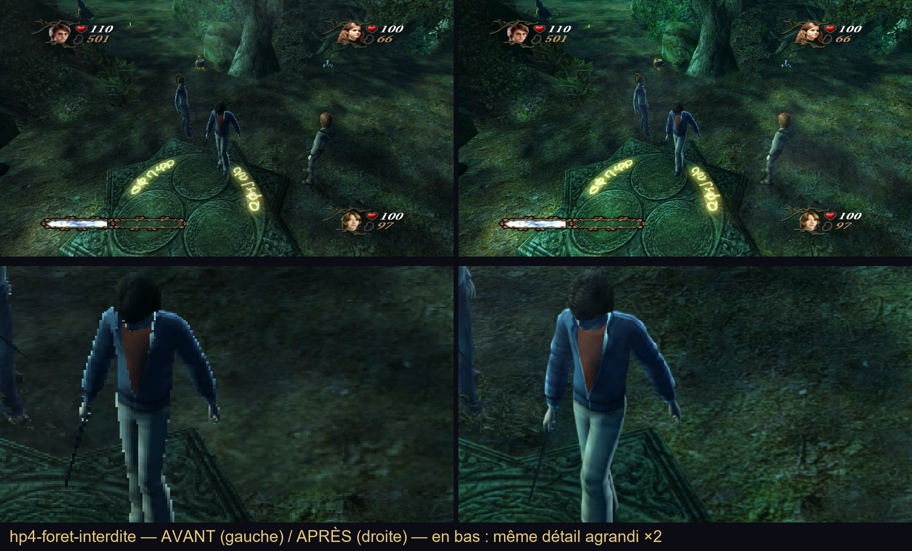
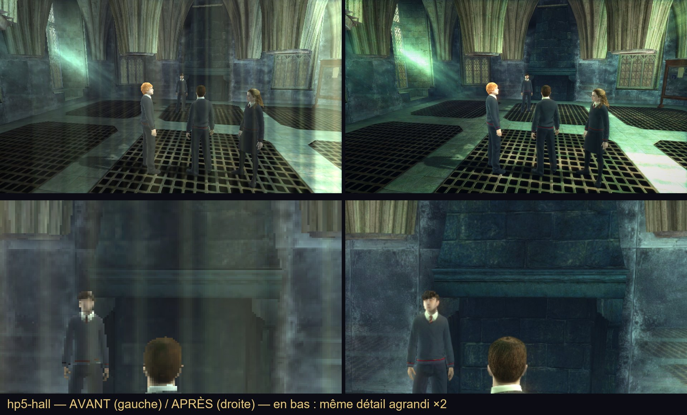
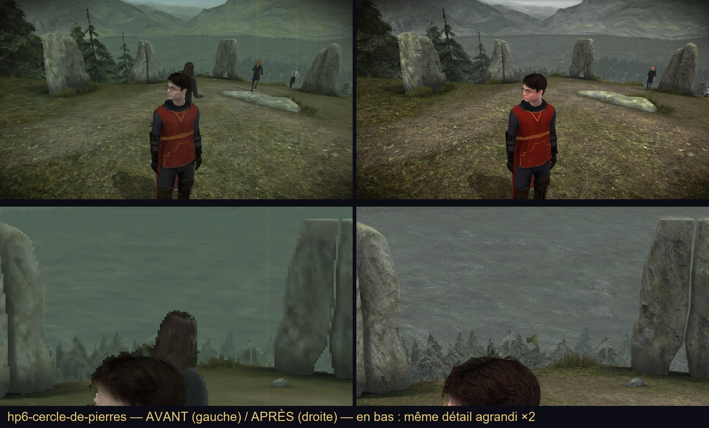

# Harry Potter PC Fix

**Français** · [English](README.en.md)

[](https://github.com/ludvdber/Harry-Potter-PC-Fix/actions/workflows/build.yml)
[](license)
[](https://acciolauncher.be/)

Avant à gauche, avec le correctif à droite ; en bas, le même détail agrandi deux fois.







Un correctif PC pour les trois jeux Harry Potter qu'Electronic Arts a bâtis sur la même famille de moteur, conçu pour [Accio Launcher](https://acciolauncher.be/). C'est une seule `d3d9.dll` posée à côté de l'exécutable du jeu : le jeu la charge à la place du Direct3D 9 du système, et elle transmet tout au vrai. La même DLL sert les trois jeux et reconnaît celui qui la charge ; chaque jeu a son propre `d3d9.ini`.

| Jeu | Année | Exécutable | Réglages | Fichier de release |
|---|---|---|---|---|
| *Harry Potter et la Coupe de feu* | 2005 | `gof_f.exe` | [`data/HP4/d3d9.ini`](data/HP4/d3d9.ini) | `HP4-Goblet-of-Fire.zip` |
| *Harry Potter et l'Ordre du Phénix* | 2007 | `hp.exe` | [`data/HP5/d3d9.ini`](data/HP5/d3d9.ini) | `HP5-Order-of-the-Phoenix.zip` |
| *Harry Potter et le Prince de sang-mêlé* | 2009 | `hp6.exe` | [`data/HP6/d3d9.ini`](data/HP6/d3d9.ini) | `HP6-Half-Blood-Prince.zip` |

Le plein écran exclusif devient une fenêtre sans bordure qui survit à Alt+Tab, le clavier et la souris répondent dès le retour dans le jeu, chaque touche se change, et la résolution, le format d'image, le champ de vision et les images/s du moteur se règlent. Des effets d'image facultatifs affinent et étalonnent le rendu. Tout se règle dans `d3d9.ini`, lu une fois au lancement du jeu.

**Une base commune.** Les réglages livrés sont les mêmes pour tout le monde, pensés pour l'écran le plus répandu (1920×1080). Une interface dans Accio Launcher permettra ensuite à chacun d'adapter les siens.

---

## Ce que ça corrige

### Fenêtre, premier plan et commandes (les trois jeux)

| | Réglage | |
|---|---|---|
| Fenêtre sans bordure | `Windowed`, `WindowStyle` | À la place du plein écran exclusif, où Alt+Tab fige le jeu. Le style 1 couvre l'écran ; 2 à 4 sont des fenêtres. |
| Fenêtre qui tient dans l'écran | `FitToScreen` | En fenêtre avec bordure (styles 2 et 3), une image de la taille de l'écran donnait une fenêtre plus grande que lui : le bas passait sous la barre des tâches. `1`, le défaut, la réduit dans la place libre de l'écran (proportions gardées) et l'y maintient, même quand le jeu la redimensionne lui-même ; agrandie au maximum, elle reste à Windows. `0` : la taille de l'image plus la bordure. |
| Le jeu continue en arrière-plan | `KeepRunningInBackground` | Le moteur arrête son horloge au moindre signe qu'un autre programme passe devant. Ces signes lui sont cachés : il continue pendant que vous êtes ailleurs. Comme il ne sait plus qu'il doit rendre le pointeur de la souris, celui-ci est affiché à sa place au-dessus du jeu. |
| Clavier et souris dès le retour | `RetakeInputOnReturn` | Les jeux lisent leurs périphériques en DirectInput exclusif et ne sont jamais prévenus de leur retour au premier plan : le clavier restait mort jusqu'à 30 secondes. Le retour est détecté et chaque périphérique repris à sa lecture suivante. Dans l'autre sens, une souris exclusive garde le curseur dans la fenêtre du jeu : dès qu'une autre fenêtre passe devant, elle est relâchée, sinon la souris ne pouvait plus sortir du jeu. |
| Plus de touche bloquée après Alt+Tab | `ReleaseKeysOnReturn` | Une touche relâchée dans une autre fenêtre n'arrivait jamais au jeu, qui la croyait encore enfoncée (Harry qui marche tout seul). Elle est relâchée pour le jeu aussi. |
| Vos propres touches | `[Accio.Keys]` | N'importe quelle touche ou bouton de souris pour n'importe quelle touche du jeu, nommée comme elle est imprimée sur **votre** clavier : ZQSD en AZERTY s'écrit tel quel. *La Coupe de feu* a aussi des actions nommées (`Charm`, `Jinx`, `Accio`…) et un préréglage prêt dans son ini. |

### Dans *Harry Potter et la Coupe de feu* (`gof_f.exe`)

| | Réglage | |
|---|---|---|
| Résolution de départ | `Width` / `Height` | Le moteur démarre en 800×600 avant de lire ses options ; il démarre ici dans la taille choisie. |
| Format d'image | `AspectRatio` | Le jeu dessine en 4:3. 16:9 par défaut ici ; tout format fonctionne (16:10, 21:9, 32:9, 2.37…). |
| Champ de vision | `FOV` | Un facteur sur les 114,6° du jeu : 1.15, 1.25 ou 1.40 élargissent la vue. |
| Animations | `AnimationRate` | Les personnages sont animés à 20 images/s ; 25 ou 30 les rendent plus fluides. |
| Référence d'images/s | `FrameRateCap` | 60 à l'origine, ce qui bride le jeu ; 120 par défaut, pour qu'il suive `FPSLimit`. |
| Images/s | `FPSLimit` | 120 par défaut (100 auparavant) : mesuré en jeu à 119 images/s de moyenne, 1 % low 111 contre 94, et le jeu ne va pas plus vite. |
| Plantage au-delà de 2048 pixels | `HazeOverlay` | La brume de la Forêt interdite, du lac, du labyrinthe et du cimetière est rangée dans un tableau de 129 colonnes de 16 pixels : un écran plus large le fait déborder et le jeu plante. `1`, le défaut, la dessine avec un nombre de colonnes plafonné (colonnes plus larges, même brume : Forêt interdite jouée en entier en 2880 pixels de large, sans plantage) ; `0` la retire comme l'ancien correctif. |
| Plantage à l'invite de sauvegarde | `AudioStreamGuard` | Environ un démarrage sur dix, deux secondes après le « Oui » de la sauvegarde automatique, le lecteur de musique du jeu lisait un flux dont le tampon n'existait pas encore, et le jeu plantait. `1`, le défaut, compte cette lecture comme vide (le jeu sait déjà la traiter) et la partie continue ; `0` comme à l'origine. Vu : même situation avec et sans, plantage sans, partie qui continue avec. |
| Manettes PlayStation | `PlayStationController` | Le jeu ne joue qu'avec les manettes de sa propre liste (45 modèles de 2005, ni Sony ni Xbox) : une DualShock 4 ou une DualSense était ignorée. `1`, le défaut, les ajoute à la liste que le jeu lit, sans rien écrire dans le registre ; boutons comme sur une manette PlayStation 2, stick droit compris. Vu avec une DualShock 4. |

### Dans *Harry Potter et l'Ordre du Phénix* (`hp.exe`)

| | Réglage | |
|---|---|---|
| Résolution de départ | `Width` / `Height` | Le moteur démarre en 640×480 avant de lire ses options ; il démarre ici dans la taille choisie. |
| Format d'image | `AspectRatio` | Le 16:9 du jeu, remplaçable par n'importe quel format (16:10, 21:9, 32:9, 2.37…). |
| Champ de vision | `FOV` | Un facteur sur la vue du jeu : 1.15, 1.25 ou 1.40 l'élargissent. |
| Limite de 30 images/s levée | `UnlockFrameRate` | Le jeu démarre avec un intervalle de présentation de 2 (30 images/s) ; il passe à 1. |
| Plafond d'images/s | `FrameRateCap` | Le plafond que le moteur garde en mémoire et remet parfois à zéro, tenu à 120. |
| Images régulières | `FPSLimit` | 120 par défaut, pour la même raison que dans *le Prince de sang-mêlé* : le plafond du jeu seul procède par à-coups (1 % low mesuré à 38 images/s dans la salle commune, contre 84 avec la limite). |
| Brouillard lointain | `DistanceFog` | Le même interrupteur que dans *le Prince de sang-mêlé*. `1`, le défaut, garde le brouillard tel que livré ; `0` le retire (pas encore vu en extérieur dans ce jeu). |
| Niveau de détail au premier lancement | `TextureDetail` | Comme dans *le Prince de sang-mêlé* : `2`, le défaut, démarre en « Quality » tant qu'aucun niveau n'est enregistré ; un niveau choisi dans les options du jeu reste le sien. |

### Dans *Harry Potter et le Prince de sang-mêlé* (`hp6.exe`)

| | Réglage | |
|---|---|---|
| Résolution de départ | `Width` / `Height` | Le moteur démarre en 640×480 avant de lire ses options ; il démarre ici dans la taille choisie. |
| Format d'image | `AspectRatio` | Le 16:9 du jeu, remplaçable par n'importe quel format (16:10, 21:9, 32:9, 2.37…). |
| Champ de vision | `FOV` | Un facteur sur la vue du jeu : 1.15, 1.25 ou 1.40 l'élargissent. |
| Limite de 30 images/s levée | `UnlockFrameRate` | Le jeu démarre avec un intervalle de présentation de 2 (30 images/s) ; il passe à 1. |
| Plafond d'images/s | `FrameRateCap` | Le plafond que le moteur garde en mémoire et remet parfois à zéro, tenu à 120 (sauf quand le moteur le met lui-même à 0). |
| Images régulières | `FPSLimit` | 120 par défaut. Le plafond du jeu seul tient 120 images/s en moyenne, mais par à-coups : des images très rapides puis une attente de 25 ms (1 % low mesuré à 31 images/s, contre 102 avec la limite). |
| Langue au démarrage | `Language` | Le menu des 16 langues s'ouvre sur celle de Windows et la prend seul au bout de 15 s, mais le jeu ne connaît qu'une variante de chaque langue : un Windows en français de Belgique, de Suisse ou du Canada, ou en espagnol tel que Windows le règle aujourd'hui en Espagne, le faisait démarrer en anglais. `auto` (défaut) ramène la langue de Windows à celle que le jeu connaît ; `fr`, `en`, `es`, `de`, `it`… choisissent ; `windows` laisse faire le jeu. |
| Brouillard lointain | `DistanceFog` | Le jeu noie le décor lointain dans un voile vert : les collines autour du château y fondent. `0` le retire (collines nettes et contrastées, scène un peu plus sombre) ; `1`, le défaut, le garde tel que livré. |
| Niveau de détail au premier lancement | `TextureDetail` | Tant qu'aucun niveau n'est enregistré, le jeu démarre en « Balanced », sans le dire. `2`, le défaut, le fait démarrer en « Quality », les textures les plus fines ; `1` comme livré, `0` « Speed ». Un niveau choisi dans les options du jeu reste le sien, et rien n'est écrit dans le registre. |

Chaque modification est faite dans l'exécutable une fois chargé, jamais sur le disque, et seulement là où les octets attendus sont trouvés : une autre version du jeu tourne simplement sans changement, et le journal le dit.

### Image

- *Harry Potter et la Coupe de feu* : suréchantillonnage 1,5 (le jeu le prend tout seul : sa scène est dessinée à 1,5 fois la taille de l'image), filtrage anisotrope ×16, FXAA, occlusion ambiante, bloom réservé aux points les plus lumineux (`BloomThreshold=0.85`, `BloomStrength=0.25` : la pensive était trop lumineuse), rayons de lumière, l'étalonnage doux du Prince de sang-mêlé et des mipmaps nettes qui gardent leur densité, activés par défaut ; joué ainsi jusqu'à la Forêt interdite.
- *Harry Potter et l'Ordre du Phénix* : les effets d'image sont activés par défaut, avec les valeurs livrées depuis la première version du correctif.
- *Harry Potter et le Prince de sang-mêlé* : suréchantillonnage 1,5, filtrage anisotrope ×16, FXAA, occlusion ambiante, bloom et un étalonnage doux (vibrance 0.30, contraste 0.20, `SkinProtect=0.70`) activés par défaut, choisis effet par effet sur des paires avant/après de la même image ; pas de MSAA ni de rayons de lumière.

| | Réglage | |
|---|---|---|
| Mipmaps pour toutes les textures | `GenerateMipmaps`, `ForceTrilinear` | La plupart des textures sont livrées sans copies réduites pour le lointain, d'où le scintillement et le flou à distance. Elles sont construites au chargement de chaque texture. |
| Textures nettes au loin | `MipmapFilter` | Comment ces copies sont réduites : `0` un filtre doux (le défaut), `1` un filtre net qui garde le détail au loin (sinc fenêtré de Kaiser). Environ 17 % de temps en plus au chargement d'une texture, rien pendant le jeu. |
| Feuillages denses au loin | `MipmapCoverage` | Branches, feuilles, cheveux et grilles sont découpés : un point est dedans ou dehors. Réduits, leurs bords deviennent à moitié transparents et le jeu les écarte, si bien que les arbres s'éclaircissent puis disparaissent avec la distance. `1` garde dans chaque copie la même part de points découpés que dans la texture entière. Désactivé par défaut. |
| MSAA | `Antialiasing` | Appliqué à la scène 3D elle-même : les jeux la dessinent dans une image à eux avant de la recopier à l'écran, et un MSAA posé sur l'écran seul ne l'atteignait pas. Abaissé pas à pas (16, 8, 4, 2, rien) jusqu'à ce que la carte graphique l'accepte, au lieu de se couper. Sans effet sur la scène avec `SSAO=1` (Direct3D 9 ne sait pas multi-échantillonner la profondeur que lit l'occlusion). |
| Cheveux et feuillage lissés | `TransparencyAntialiasing` | Avec `Antialiasing` : les bords découpés des cheveux, des feuilles et de l'herbe restent en escalier sous le seul MSAA ; ils sont suréchantillonnés (cartes NVIDIA seulement, sans effet ailleurs). Vu dans la Coupe de feu (mèches au choix du personnage) et le Prince de sang-mêlé (pins, cheveux). Coût mesuré sur une RTX 2060 SUPER : 1 % low de 101 à 76 images/s dans le Prince de sang-mêlé en 2560×1440, de 94 à 84 dans la Coupe de feu. Désactivé par défaut. |
| Filtrage anisotrope, netteté des textures | `AnisotropicFiltering`, `TextureLODBias` | Forcés sur toutes les textures. |
| FXAA et accentuation | `FXAA`, `Sharpness` | Une passe sur l'image finie ; elle porte aussi les effets ci-dessous. |
| Étalonnage des couleurs | `ColorGrading` et les valeurs dessous | Noirs, gain, gamma, balance des blancs, contraste, vibrance, virage partiel, vignettage ; `SkinProtect` (0 à 1) épargne aux visages une part du contraste et de la vibrance ; `YellowRestraint` (0 à 1) tient les jaunes à l'écart de la vibrance et les atténue un peu (HP5 : 1, sa pierre et son herbe viraient au jaune vif) ; `GreenRestraint` (0 à 1) retire le vert menthe du ciel et du lointain (HP5, HP6), sans toucher à l'herbe ni aux visages ; `ContrastPivot` est le gris que le contraste laisse en place (0,5 = comme avant ; plus bas, du relief sans assombrir un jeu sombre). Les deux sont neutres par défaut. |
| Occlusion ambiante | `SSAO` et ses valeurs | Dessinée dès que la scène 3D est finie, avant les menus et sous-titres. |
| Halo et rayons de lumière | `Bloom`, `GodRays` | En demi-résolution, estompés sur les menus et les écrans blancs. |
| Suréchantillonnage | `SSAAFactor`, `SSAAMaxHeight` | L'image est calculée plus grande puis réduite : tous les contours lissés, sans flou. `1` = éteint, `1.5`, `2`… jusqu'à `4`. Très gourmand : `2` calcule quatre fois plus de points, `1.5` un peu plus de deux fois. L'image agrandie ne dépasse jamais `SSAAMaxHeight` lignes (2880 : un écran 4K passe de 1,5 à 1,33), ni ce que la carte graphique accepte ; si la carte refuse quand même, le jeu démarre sans suréchantillonnage. |
| Taille de rendu | `RenderWidth`, `RenderHeight` | 0 = la taille choisie dans le jeu ; -1 = celle de l'écran. |

### Performances, comme un outil de benchmark (`[Accio.Overlay]`)

Chaque ligne s'active séparément, tout est coupé par défaut : images/s (`ShowFPS`), temps par image et « 1 % low » (`ShowFrameTime`), graphe des 240 dernières images (`ShowGraph`), processeur du jeu et de son fil principal (`ShowCPU`), charge de la carte graphique (`ShowGPU`), mémoire vidéo (`ShowVRAM`) et vive (`ShowRAM`), latence entre la lecture d'une touche et l'envoi de l'image (`ShowLatency`). F10 affiche ou cache le panneau (`OverlayKey`) ; F11 démarre puis arrête un benchmark (`BenchmarkKey`) : moyenne, 1 % et 0,1 % low et pire image à l'écran, et chaque image dans le dossier `benchmarks`.

Pour juger les effets d'image, `CompareKey` (coupée par défaut, 119 = F8) les éteint puis les rallume en direct : étalonnage, netteté, occlusion ambiante, bloom, rayons, filtrage anisotrope et biais de détail des textures. La même scène avec et sans, à un dixième de seconde d'écart. L'anticrénelage MSAA reste tel quel (il se choisit à la création de l'image, pas après).

Et aussi : une touche de capture d'écran (`ScreenshotKey`, F12 par défaut, PNG dans `screenshots`, ou dans `ScreenshotFolder` : Accio Launcher y met `Images\Accio Launcher\<jeu>`, qu'une désinstallation n'efface pas), une limite d'images/s (`FPSLimit`), une seule image d'avance chez le pilote au lieu de trois (`MaxFrameLatency`), et `DPIAware` pour les écrans à haute densité (activé dans *l'Ordre du Phénix* et *le Prince de sang-mêlé* : sans lui, en fenêtre, Windows agrandissait la fenêtre de l'échelle d'affichage, 3200×1518 sur un écran 2560×1440 à 125 %, image coupée).

### Manettes (`xinput1_3.dll`, `[Accio.Controller]`)

*L'Ordre du Phénix*, *le Prince de sang-mêlé* et les deux *Reliques de la Mort* lisent la manette par XInput, dans un `xinput1_3.dll` que Windows ne livre pas (il vient du runtime DirectX de juin 2010). Le correctif apporte le sien :

| | Réglage | |
|---|---|---|
| Manette Xbox | | Transmise telle quelle au XInput de Windows (`xinput1_4.dll`) : le runtime DirectX de 2010 n'est plus nécessaire pour elle. |
| Manette PlayStation 4 ou 5 | `PlayStation` | Lue directement et présentée au jeu comme une manette Xbox, à la première place qu'aucune manette Xbox n'occupe. `0` si un outil (Steam Input, DS4Windows) la transforme déjà en manette Xbox : le jeu la verrait deux fois. |
| Vibrations | `Rumble` | Renvoyées à la manette PlayStation (USB). |
| Barre lumineuse | `LightBar` | Une couleur `rouge,vert,bleu` posée sur la manette PlayStation (USB), à chaque fois qu'elle est branchée ; vide, elle n'est pas touchée. Accio Launcher y met la couleur de votre maison. |

La *Coupe de feu* lit ses manettes par DirectInput et n'est pas concernée : ses manettes PlayStation passent par `PlayStationController`, plus haut.

---

## Installation

**Avec [Accio Launcher](https://acciolauncher.be/)** : rien à faire, chaque jeu arrive avec son correctif.

**À la main** : prenez le zip de votre jeu dans une [release](https://github.com/ludvdber/Harry-Potter-PC-Fix/releases) et copiez ses fichiers (`d3d9.dll`, `d3d9.ini`, et `xinput1_3.dll` pour les jeux qui l'utilisent) à côté de l'exécutable du jeu. Les fichiers laissés par d'anciens correctifs (`d3d9_original.dll`, `fps.dll`) peuvent être supprimés : plus rien ne les charge.

Le correctif ne contient aucun fichier de jeu : il s'installe sur **votre** copie, que vous devez posséder (CD, DVD ou achat numérique).

**Sous Linux** (Wine ou Proton), Wine utilise son propre `d3d9` sauf indication contraire : `WINEDLLOVERRIDES="d3d9=n,b"`. Accio Launcher le fait pour vous. Pas `xinput1_3` : le XInput de Wine reconnaît déjà les manettes PlayStation.

Les réglages sont lus au lancement : modifiez `d3d9.ini`, puis relancez le jeu. Chaque ligne du fichier est commentée. Un `d3d9.ini` écrit pour un ancien correctif fonctionne encore : les clés absentes des sections `[Accio.*]` sont lues là où les anciennes versions les rangeaient.

---

## En cas de problème

Chaque lancement écrit `d3d9_accio.log` à côté de l'exécutable du jeu (`Log=0` le désactive). On y lit le jeu reconnu, chaque modification faite ou sautée, ce que Direct3D a accepté (fenêtre, taille d'image, MSAA, profondeur lisible), les départs et retours au premier plan, et la reprise du clavier et de la souris. Joignez-le à tout [signalement de bug](https://github.com/ludvdber/Harry-Potter-PC-Fix/issues/new/choose).

---

## Compiler

Visual Studio 2022 (charge de travail C++ Desktop), Win32 uniquement : les jeux sont en 32 bits.

```powershell
& "C:\Program Files (x86)\Microsoft Visual Studio\2022\BuildTools\MSBuild\Current\Bin\MSBuild.exe" `
    build\accio-fix.sln /p:Configuration=Release /p:Platform=Win32 /v:minimal
```

Sortie : `data\d3d9.dll` et `data\xinput1_3.dll`. Sans aucun jeu, `tests\run_keys_test.bat` vérifie la réassignation des touches, `tests\run_settings_test.bat` relit chaque `d3d9.ini` (et un fichier à l'ancien format) avec le lecteur de la DLL, `tests\run_mipmaps_test.bat` le filtre des mipmaps et les formats de texture, `tests\run_xinput_test.bat` la lecture des manettes PlayStation. Les ini sont générés par `python tools\make_ini.py` ; le build échoue s'ils ne correspondent plus.

| Chemin | Rôle |
|---|---|
| `source/main.cpp` | Point d'entrée, exports, chargement du Direct3D 9 du système |
| `source/settings.cpp` | Lecture de `d3d9.ini` |
| `source/hooks.cpp` | Tables de méthodes, tables d'imports, octets de l'exécutable |
| `source/game.cpp` | Ce qui est modifié dans chaque jeu, et où |
| `source/window.cpp` | Style et position de la fenêtre, premier plan |
| `source/input.cpp` | DirectInput : retour au premier plan, touches bloquées |
| `source/keys.cpp` | `[Accio.Keys]` |
| `source/direct3d.cpp` | Création et réinitialisation du périphérique, textures, profondeur, échantillonneurs |
| `source/present.cpp` | À chaque image : effets, captures, affichage des performances, limite d'images/s |
| `source/overlay.cpp` | `[Accio.Overlay]` : mesures, graphe, benchmark |
| `source/effects.cpp`, `source/shaders/*.hlsl` | Effets d'image (shaders compilés au build) |
| `source/mipmaps.cpp` | Mipmaps et formats de texture, sans D3DX |
| `source/xinput/` | `xinput1_3.dll` : manettes Xbox et PlayStation |
| `source/version.h` | Version inscrite dans la DLL (doit correspondre à `VERSION`) |
| `data/HP4`, `data/HP5`, `data/HP6` | Le `d3d9.ini` de chaque jeu |
| `tools/make_ini.py` | Génère ces trois fichiers |

### Depuis GitHub, sans rien installer

**Build automatique.** Chaque push et chaque pull request lance le workflow **Build** : compilation, tests, vérification que la DLL est bien une DLL 32 bits, que les trois ini sont à jour et que la version est la même dans `VERSION` et `source/version.h`. La DLL : **Actions** → **Build** → le run → **Artifacts** → `d3d9-win32`.

**Build d'essai (rien n'est publié).** **Actions** → **Release** → **Run workflow**, case **Créer la release** décochée. Une fois le run vert : **Artifacts** → `release-v<VERSION>` (la DLL et un zip par jeu).

**Créer une release.**

1. Changer le numéro dans `VERSION` **et** dans `source/version.h` (`ACCIO_VERSION_NUM` et `ACCIO_VERSION_STR`), dans le même commit.
2. **Actions** → **Release** → **Run workflow** → cocher **Créer la release** → **Run workflow**.
3. Une fois le run vert : **Releases** → le brouillon `v<VERSION>` → relire → **Edit** → **Publish release**. Rien n'est public avant ce clic.

Chaque fichier de release porte une attestation de provenance signée : `gh attestation verify d3d9.dll --repo ludvdber/Harry-Potter-PC-Fix`.

---

## Licence

© 2026 Accio Launcher. **Ce correctif n'est pas libre** : [PolyForm Strict 1.0.0 avec une permission supplémentaire](license).

- ✅ Vous pouvez lire le code, le forker sur GitHub, le modifier et le compiler **pour votre usage personnel**.
- ❌ Vous ne pouvez pas le redistribuer, modifié ou non, compilé ou en source, en tout ou en partie : ni sur un site de mods (Nexus Mods, ModDB…), ni sur un hébergeur de fichiers, un forum, un serveur Discord, un Patreon, un repack ou un autre launcher, gratuitement ou non.
- ❌ Vous ne pouvez pas le vendre, le mettre derrière un paiement, un abonnement ou une publicité, ni utiliser les noms « Accio Launcher » ou « Harry Potter PC Fix » pour une copie.

Les seules sources officielles sont [Accio Launcher](https://acciolauncher.be/) et les releases de ce dépôt. Une copie trouvée ailleurs n'est pas la nôtre : elle peut être modifiée, et elle sera signalée pour suppression.

Le correctif ne contient le code de personne d'autre ([avis](THIRD_PARTY_NOTICES.md)). Les jeux et leurs fichiers appartiennent à leurs propriétaires (Electronic Arts, Warner Bros.) ; ce projet ne revendique aucun droit sur eux et n'en distribue aucun.

Ce projet vous est utile ? [Un café sur Ko-fi](https://ko-fi.com/ludovic01) fait avancer le correctif et le launcher (il ne paie aucun jeu).
